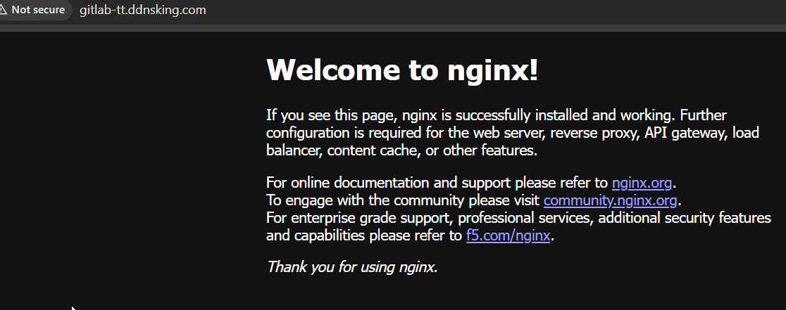

thiru@thiru-dh170-master:~$ curl -L https://istio.io/downloadIstio | sh -
  % Total    % Received % Xferd  Average Speed   Time    Time     Time  Current
                                 Dload  Upload   Total   Spent    Left  Speed
100   101  100   101    0     0   1185      0 --:--:-- --:--:-- --:--:--  1202
100  5124  100  5124    0     0  13367      0 --:--:-- --:--:-- --:--:-- 13367

Downloading istio-1.29.1 from https://github.com/istio/istio/releases/download/1.29.1/istio-1.29.1-linux-amd64.tar.gz ...

Istio 1.29.1 download complete!

The Istio release archive has been downloaded to the istio-1.29.1 directory.

To configure the istioctl client tool for your workstation,
add the /home/thiru/istio-1.29.1/bin directory to your environment path variable with:
         export PATH="$PATH:/home/thiru/istio-1.29.1/bin"

Begin the Istio pre-installation check by running:
         istioctl x precheck

Try Istio in ambient mode
        https://istio.io/latest/docs/ambient/getting-started/
Try Istio in sidecar mode
        https://istio.io/latest/docs/setup/getting-started/
Install guides for ambient mode
        https://istio.io/latest/docs/ambient/install/
Install guides for sidecar mode
        https://istio.io/latest/docs/setup/install/

Need more information? Visit https://istio.io/latest/docs/
thiru@thiru-dh170-master:~$ ls
config  Desktop  Documents  Downloads  istio-1.29.1  Music  Pictures  Public  snap  Templates  Videos
thiru@thiru-dh170-master:~$ cd istio-1.29.1/
thiru@thiru-dh170-master:~/istio-1.29.1$ ll
total 48
drwxr-x---  6 thiru thiru  4096 Mar  7 03:06 ./
drwxr-x--- 19 thiru thiru  4096 Mar 29 14:39 ../
drwxr-x---  2 thiru thiru  4096 Mar  7 03:06 bin/
-rw-r--r--  1 thiru thiru 11357 Mar  7 03:06 LICENSE
drwxr-xr-x  4 thiru thiru  4096 Mar  7 03:06 manifests/
-rw-r-----  1 thiru thiru   924 Mar  7 03:06 manifest.yaml
-rw-r--r--  1 thiru thiru  7377 Mar  7 03:06 README.md
drwxr-xr-x 28 thiru thiru  4096 Mar  7 03:06 samples/
drwxr-xr-x  3 thiru thiru  4096 Mar  7 03:06 tools/
thiru@thiru-dh170-master:~/istio-1.29.1$ export PATH=$PWD/bin:$PATH
thiru@thiru-dh170-master:~/istio-1.29.1$ cd
thiru@thiru-dh170-master:~$ is
isadump                   ischroot                  isdv4-serial-inputattach  ispell-autobuildhash      istioctl
isaset                    isdv4-serial-debugger     isosize                   ispell-wrapper
thiru@thiru-dh170-master:~$ istioctl version
Istio is not present in the cluster: no running Istio pods in namespace "istio-system"
client version: 1.29.1
thiru@thiru-dh170-master:~$ istioctl install --set profile=minimal
        |\
        | \
        |  \
        |   \
      /||    \
     / ||     \
    /  ||      \
   /   ||       \
  /    ||        \
 /     ||         \
/______||__________\
____________________
  \__       _____/
     \_____/

This will install the Istio 1.29.1 profile "minimal" into the cluster. Proceed? (y/N) y
✔ Istio core installed ⛵️
✔ Istiod installed 🧠
✔ Installation complete
thiru@thiru-dh170-master:~$

thiru@DESKTOP-HCARDK6:~$ kubectl get crd gateways.gateway.networking.k8s.io &> /dev/null || \
  { kubectl kustomize "github.com/kubernetes-sigs/gateway-api/config/crd?ref=v1.4.0" | kubectl apply -f -; }

customresourcedefinition.apiextensions.k8s.io/backendtlspolicies.gateway.networking.k8s.io created
customresourcedefinition.apiextensions.k8s.io/gatewayclasses.gateway.networking.k8s.io created
customresourcedefinition.apiextensions.k8s.io/gateways.gateway.networking.k8s.io created
customresourcedefinition.apiextensions.k8s.io/grpcroutes.gateway.networking.k8s.io created
customresourcedefinition.apiextensions.k8s.io/httproutes.gateway.networking.k8s.io created
customresourcedefinition.apiextensions.k8s.io/referencegrants.gateway.networking.k8s.io created

 kubectl get gc
NAME           CONTROLLER                    ACCEPTED   AGE
istio          istio.io/gateway-controller   True       2m12s
istio-remote   istio.io/unmanaged-gateway    True       2m12s
thiru@thiru-dh170-master:~$

apply

apiVersion: gateway.networking.k8s.io/v1
kind: Gateway
metadata:
  name: web-gateway
spec:
  gatewayClassName: istio
  listeners:
  - name: http
    protocol: HTTP
    port: 80

and then 

apiVersion: gateway.networking.k8s.io/v1
kind: HTTPRoute
metadata:
  name: webserver-httproute
spec:
  parentRefs:
  - name: web-gateway
  hostnames:
  - "www.thirutech.com"
  - "gitlab-tt.ddnsking.com"
  rules:
  - matches:
    - path:
        type: PathPrefix
        value: /
    backendRefs:
    - name: my-nginx
      port: 80

hiru@DESKTOP-HCARDK6:/mnt/c/Users/Arasu/Documents/cka/Gatewayapi$ kubectl get httproutes.gateway.networking.k8s.io 
NAME                  HOSTNAMES                                        AGE
webserver-httproute   ["www.thirutech.com","gitlab-tt.ddnsking.com"]   5m1s

